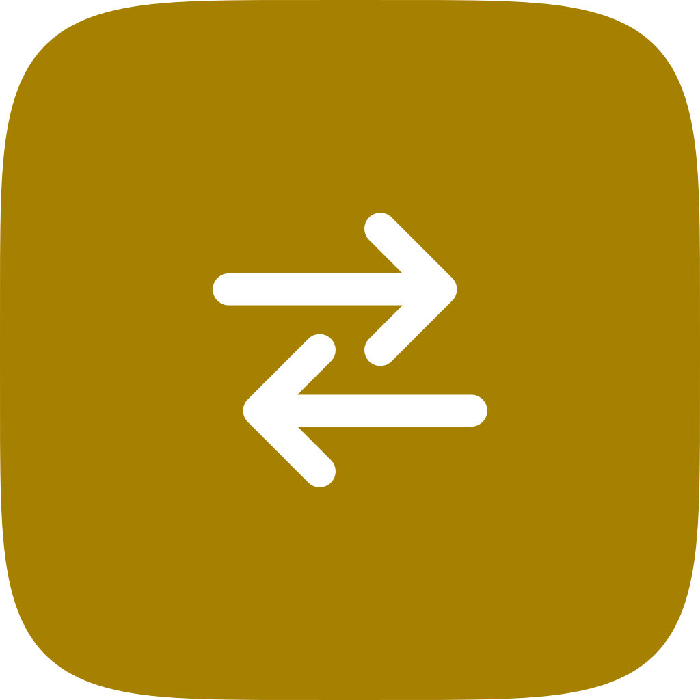

# Moli Switch 输入法



按前台应用、终端程序和输入框自动切换 macOS 输入法。

[](https://github.com/MoliDuo/MoliSwitch/actions/workflows/ci.yml)
[](https://github.com/MoliDuo/MoliSwitch/releases/latest)


以前叫 AutoInputSwitcher。

## 功能

- 每个应用一条输入法规则：“默认”“中文”“英文”“不切换”，或直接选一个输入法；“中文”“英文”分别用哪个输入法只需在页面顶部指定一次。
- 默认输入法：没单独设规则的应用成为前台时都切到它。
- 在“终端”和 iTerm2 里按正在运行的程序切换：比如 claude、codex 用中文，vim 和 shell 用英文。
- 同一个 App 里按输入框切换：浏览器地址栏默认用英文，也可以记住某个输入框（比如微信的搜索框）单独用一个输入法。
- 在勾选的 App 里，输入框开头打 `/` 输命令时自动切到英文，命令结束后切回来。
- 按住 Shift 打英文：用中文输入法时按住 Shift 打的字母和符号都是英文，松开后切回。
- 根据本机的使用日志给出规则建议。
- 规则只保存在本机（`~/Library/Application Support/MoliSwitch/`）。
- 关闭窗口后继续在后台运行，不显示 Dock 图标，可选菜单栏图标；可设置为登录时打开。
- 应用内更新，每小时检查一次新版本。

### 打开与退出

- 从 Finder、Spotlight 或启动台打开时显示主窗口；已经在运行时再打开一次，也会把窗口带到前面。
- 登录时自动打开的那一次不显示窗口，只在后台运行。
- 关闭窗口（⌘W）后 Moli Switch 继续运行。要退出，在窗口里按 ⌘Q，或点菜单栏图标 › 退出 Moli Switch。
- 菜单栏图标的菜单里有：记住当前输入框、打开 Moli Switch…（⌘,）、检查更新…、关于、退出。
- 在“通用”里关掉菜单栏图标后，再次打开 Moli Switch 即可回到主窗口。

主窗口左侧有四个页面：

- 应用：顶部是默认、中文、英文输入法；下面每个 App 一行，选中后右边列出这个 App 的全部设置：输入法、斜杠命令、按住 Shift 打英文、记住的输入框，终端多一项“终端程序”，浏览器多一项“地址栏”。
- 打字时切换：按住 Shift、斜杠命令这两个功能的总开关和对所有 App 的设置。
- 优化建议：根据使用日志给出的规则建议，以及使用日志的开关。
- 通用：登录时打开、菜单栏图标、系统光标旁的输入法提示、版本和更新。

缺少辅助功能权限、系统光标提示会让按键卡顿这类需要处理的问题，在任何页面的顶部都会提示。

### 应用

页面顶部的“默认”作用于所有没有单独设置的应用，初始为“不切换”。下面的表格里，每个已安装的应用占一行：

- “默认（…）”：跟随默认输入法，括号里显示默认现在是什么。
- “不切换”：该应用始终不做自动切换，默认输入法也不会作用于它。
- “中文”或“英文”：切到页面顶部设置的中文或英文输入法。以后换了中文输入法，只要改一处，所有“中文”规则都会跟着变。
- 下拉框下半部分列出其他输入法（比如日文），也可以直接选一个具体的输入法。
- 规则里保存的输入法在当前系统上不可用时，选择器会保留一项“不可用：{已保存名称}”，规则不会被自动删除或改写，请手动改选。
- 规则指向的应用已经卸载时，该行标记“未找到应用”，仍可修改规则。

应用名下面的小字列出这个 App 除输入法以外的设置，比如“/ 命令 · ⇧ 自定义 · 2 个输入框”。

选中一个 App，右边的设置栏里还有：

- 打字时：“输入 / 命令时切到英文”，见“斜杠命令”；“按住 Shift 打英文”选“默认”时用“打字时切换”里的设置，也可以改成“关闭”或“自定义”，见“按住 Shift 打英文”。对应的功能在“打字时切换”里没打开时是灰的，旁边有链接过去打开。
- 终端程序：只有“终端”和 iTerm2 有，见“终端程序”。
- 浏览器地址栏：只有浏览器有，见“输入框”。
- 记住的输入框：这个 App 里记住的输入框，见“输入框”。

工具栏里有搜索框、“全部 / 已设置 / 未设置”筛选、重新扫描应用与输入法的按钮，以及显示或隐藏右边设置栏的按钮。“已设置”包括选了输入法、用斜杠命令、单独设置了 Shift、记住了输入框的 App，以及添加了终端程序后的终端。

### 中文和英文输入法

“应用”页顶部的“中文”“英文”指定这两个角色，默认都是“自动识别”：

- 中文：不是键盘布局的输入法，优先系统自带的简体 / 繁体中文输入法（如“双拼”）；没有系统自带的才用第三方的（如微信键盘、搜狗）。装了多个中文输入法时建议手动指定。
- 英文：第一个键盘布局（如 U.S. 或 ABC）。

第三方输入法要先在 系统设置 › 键盘 › 输入法 中添加，之后才会出现在列表里。每次切换后会读回当前输入法确认，系统没有切过去时窗口顶部会提示。

系统自带中文输入法开启“用大小写键切换到/离开 U.S.（或 ABC）”时，按大小写键其实就是在中文输入法和 U.S. 之间切换；所以把“英文”设为 U.S.，规则选“英文”的效果和手动按一下大小写键相同。

已有规则如果直接选的是当前的中文或英文输入法，会显示为“中文”或“英文”；之后改掉这个角色时，这些规则会一起跟过去。

### 终端程序

在“应用”里选中“终端”或 iTerm2，右边的“终端程序”一节可以给命令行程序单独设规则，比如 `claude`、`codex` 用“中文”，`vim`、`nvim` 用“英文”。“终端”和 iTerm2 共用这些规则，保存在 `command-rules.json`。

- 前台是“终端”或 iTerm2 时，每 0.5 秒看一次当前标签页里正在运行的程序：命中规则就切到对应输入法；没有命中（比如回到了 shell）就用这个终端 App 自己的规则。
- 只在“该用哪条规则”变化时切换，比如启动或退出程序、换标签页、从别的 App 切回终端。停在同一个程序里手动切过的输入法不会被改回去。
- 程序名不区分大小写，依次比对：解释器运行的脚本名（如 `node …/bin/codex` 里的 `codex`）、启动时的名字（argv[0]）、可执行文件名、进程名。
- 刚在终端里跑过、还没有规则的程序，页面上会出现“添加刚才在终端中运行的…”。
- tmux 里会识别当前窗格正在运行的程序。
- ssh 只能看到 `ssh` 本身，看不到远程机器上运行的程序，所以只能给 `ssh` 整体设一条规则。
- 读取当前标签页需要“自动化”权限，第一次用到时系统会询问。拒绝后可以在 系统设置 › 隐私与安全性 › 自动化 里重新打开。
- 没有设任何程序规则、或者关掉了开关时，不会读取终端，也不会请求权限。

### 输入框

“浏览器地址栏”和“记住的输入框”（在“应用”里选中浏览器或对应的 App，右边可以看到）需要“辅助功能”权限来读取当前聚焦的是哪个输入框；只读取输入框的类型、标识和说明文字，**不读取输入的内容**。

- 浏览器地址栏：默认打开，点进地址栏时切到“英文”，离开后按下面的规则切回。可以关掉，或改成别的输入法。支持 Safari、Chrome、Edge、Brave、Vivaldi、Opera、Chromium 和 Firefox。
- 记住某个输入框：
  1. 在目标 App 里点一下要记住的输入框，手动切到想用的输入法。
  2. 点菜单栏图标，选“记住当前输入框（App · 输入法）”。
  3. 以后焦点进入这个输入框就切到这个输入法。再记一次同一个输入框会覆盖原来的输入法。
- 记住的输入框保存在 `field-rules.json`，可以在“应用”里选中这个 App，在右边改名、改输入法或删除。
- 优先级：终端程序规则 → 输入框规则（含地址栏）→ 应用规则 → 默认输入法。
- 离开输入框时，如果该 App 有自己的规则就按 App 规则切；没有的话切回进入输入框前的输入法（在输入框里手动切过的话就保持不动）。
- 和终端程序一样，只在“该用哪条规则”变化时切换。
- 只有记住了输入框的 App，或者打开了地址栏开关时的浏览器，才会被监听；没有授权时这一功能不生效，其余照常。
- 识别输入框靠的是 App 暴露的辅助功能信息：有的 App（部分 Electron 应用、网页里没有 id 的输入框）结构会随内容变化，可能认不准，这种情况只能退回应用规则。

### 斜杠命令

在 Claude、Slack、Discord 这类 App 里，输入框开头打 `/` 是在输命令。用中文输入法时 `/` 会变成“、”，命令也会打成中文。在“打字时切换”里打开“输入斜杠命令时切到英文”，再在“应用”里选中这些 App，打开右边的“输入 / 命令时切到英文”后：

- 在输入框开头打 `/`，会先切到“英文”输入法，再打出 `/`，后面的命令直接是英文。句子中间的 `/` 不受影响。
- 按回车或 Esc、焦点离开输入框或切到别的 App、把 `/` 删掉后，切回原来的输入法。
- 空格和 Tab 默认不切回，因为命令参数常常还是英文，Tab 补全后也可能接着打参数；参数要打中文的，可以打开“按空格或 Tab 后切回原输入法”。
- 命令中途手动切过输入法的话，结束时不再切回。
- 需要“辅助功能”权限来读取按键和光标位置：看按下的是哪类键（`/`、字母、回车、退格……）和光标是否在开头；开着使用日志时还会把按键字符和输入框文字记在本机日志里（密码框除外）。
- 终端（Terminal、iTerm2、Ghostty 等）拿不到行内的光标位置，改为按键判断：刚切进来、按过回车、Esc 或 ⌃U 之后，还没打别的字时算开头。打过字又按了删除键时，输入可能已经删空，这时按 `/` 也会切英文；如果其实没删空，把 `/` 删掉再按一次，就会按原输入法打出来。
- 名单保存在 `slash-command-apps.json`。

### 按住 Shift 打英文

用中文输入法时，按住 Shift 打的 `A`、`?`、`!`、`(` 会变成拼音组字或中文标点。在“打字时切换”里打开“按住 Shift 时打英文”后：

- 按住 Shift 再按勾选的键，会先切到“英文”输入法再打出来；按住 Shift 接着打的字都是英文。
- 键分三类，可以分别勾选：字母（A–Z）、数字键上的符号（`! @ # $ % ^ & * ( )`，也包括小键盘数字）、其他符号（`? : " _ + { } | < > ~`）。默认三类都勾上。比如只勾“字母”，Shift + A 打出 `A`，Shift + 1 仍是中文的 `！`。
- 按住 Shift 时先按到没勾的键，照常用中文输入法打；按到第一个勾选的键才切英文，之后到松开 Shift 都是英文。
- 松开 Shift 后切回原来的输入法。松开后马上打的字会稍等一下，切回以后再打出来，所以 `Hello` 里只有 `H` 是英文。
- 关掉“松开 Shift 后切回原输入法”的话，松开后留在英文，想打中文时自己切回（比如按大小写键）。
- 只按一下 Shift，或者 Shift 加回车、Tab、空格、方向键，不会切换，不影响输入法自己的“Shift 切中英”和 Shift + 回车换行。带 ⌘、⌃、⌥ 的快捷键也不切换。
- 当前已经是英文输入法或其他键盘布局时不切换。按住 Shift 期间手动切过输入法的话，松开后不再切回。
- 默认关闭；打开后所有 App 都用“打字时切换”里的设置。在“应用”里选中某个 App，可以在右边的“按住 Shift 打英文”里选“关闭”，或者选“自定义”，给它单独勾选三类键和“松开 Shift 后切回原输入法”。单独的设置保存在 `shift-app-rules.json`。
- 以前取消勾选“⇧ 英文”的 App，升级后第一次打开时变成“关闭”；原来的 `shift-excluded-apps.json` 保留不动，之后不再读取。
- 和斜杠命令一样需要“辅助功能”权限，只看按下的是哪类键，**不记录输入的内容**。

### 规则文件出错时

规则文件读取失败时，Moli Switch 会暂停规则编辑并在窗口顶部持续提示，原文件不会被动过；可以点“重新读取”，或点“在 Finder 中显示”手动处理。保存失败时修改不会生效，界面保留修改前的状态。

### 已知限制

- 发布包使用自签名证书，未使用 Developer ID，也未做 Apple 公证：首次安装需要手动在“隐私与安全性”里允许。
- Ed25519 更新签名保证的是“更新来自持有私钥的发布者”，不能替代 Gatekeeper 信任。
- 暂不支持增量更新、多发布通道和自建更新服务器。
- 按程序切换只支持“终端”和 iTerm2，其他终端（Ghostty、WezTerm、Warp 等）只按 App 规则切换。
- 按输入框切换、斜杠命令和按住 Shift 打英文依赖辅助功能权限。正式版用固定证书签名，授权在更新后保留。
- 正在拼音组字（还没选字）时按住 Shift 打字，切换输入法后，没选的拼音会按输入法自己的方式上屏或丢掉。
- 斜杠命令判断“在开头”依赖 App 报告的光标位置；拿不到时按键猜测，比如在已有文字的输入框里用鼠标点到开头再打 `/`，可能不会切换。
- 从 AutoInputSwitcher 改名后 Bundle ID 变了，旧版无法自动更新过来，权限也要重新授予，见“从 AutoInputSwitcher 升级”。

## 安装

1. 在 [Releases](https://github.com/MoliDuo/MoliSwitch/releases/latest) 下载 `MoliSwitch_<版本>_macos_universal.dmg`，把 Moli Switch 拖进「应用程序」。支持 macOS 14 及以上（Apple 芯片和 Intel）。
2. 应用用自签名证书签名，没有经过 Apple 公证：第一次打开如果被拦下，到「系统设置 › 隐私与安全性」点「仍要打开」。
3. 用到输入框、斜杠命令、按住 Shift 时，在「系统设置 › 隐私与安全性 › 辅助功能」里允许 Moli Switch；按终端程序切换时，在弹出的「自动化」请求里允许它控制“终端”或 iTerm2。

之后的版本在应用里提示更新，菜单栏菜单和“通用”页里也可以「检查更新…」。请先把应用放进「应用程序」再更新：直接从磁盘映像里运行时，应用会提示先移过去。

更新由 [Sparkle 2](https://sparkle-project.org) 完成：发现新版本先提示，确认后才下载安装并重启，不会在后台静默替换；后台检查遇到网络错误不打扰；手动检查会明确显示“已是最新版本”或失败原因。更新包和更新清单都校验 Ed25519 签名。

### 从 0.2.15 及更早的版本升级

0.2.15 及更早的版本是临时签名的，升级后辅助功能和自动化权限要重新授予一次；之后的版本用固定证书签名，授权会保留。

### 从 AutoInputSwitcher 升级

Moli Switch 换了名字和 Bundle ID，系统会把它当成一个新应用：

- **需要手动安装一次。** AutoInputSwitcher 的自动更新不会升级到 Moli Switch，请按上面的步骤下载安装。
- **规则和设置会自动带过来。** 第一次打开时，会把 AutoInputSwitcher 的应用规则、终端程序规则、输入框规则和各项设置复制过来（旧文件保留不动）。
- **退出并删除旧版。** 两个同时运行会重复切换输入法。发现旧版在运行时会提示退出它；之后请在 系统设置 › 通用 › 登录项 里移除 AutoInputSwitcher，再把 `AutoInputSwitcher.app` 移到废纸篓。
- **重新授权。** 辅助功能和自动化权限要重新授予一次，“登录时打开”也要在“通用”里重新打开。

## 登录方式

不需要登录：本机运行的工具，没有账号，也不联网（检查更新除外）。

## 部署

桌面应用，不部署到服务器；通过 [GitHub Releases](https://github.com/MoliDuo/MoliSwitch/releases) 分发，已安装的应用从 `releases/latest/download/appcast.xml` 读更新。

## 开发

需要 macOS 14 以上和 Swift 6 工具链（Command Line Tools 或 Xcode）。

```bash
Scripts/check.sh              # 和 CI 一样的检查：格式、lint、编译（警告算错误）、核心自检、单元测试
Scripts/check.sh --fix        # 自动格式化和自动修复 lint
Scripts/package-release.sh    # 打包 .build/MoliSwitch.app，以及 .build/dist 里的 DMG、ZIP、SHA256SUMS
Scripts/verify-package.sh     # 检查打出来的包：双架构、签名、Sparkle、ZIP 和 DMG 一致
```

只想快速试一下：`UNIVERSAL=0 Scripts/build-app.sh && open .build/MoliSwitch.app`（只编本机架构）。本地包是临时签名的，每次重新打包都要重新授予辅助功能权限。日志：`log stream --predicate 'subsystem == "com.moli.MoliSwitch"' --level debug`。

发版：在 PR 里把 `VERSION` 改成新版本并合并，然后在 `main` 上打 `vX.Y.Z` 标签并推送，`release` 工作流负责签名、发布和核对线上的更新清单。签名用的证书和 Sparkle 私钥是组织密钥，不放进仓库。

目录和设计说明见 [docs/architecture.md](docs/architecture.md)。

## 许可

保留所有权利，见 [LICENSE](LICENSE)。
